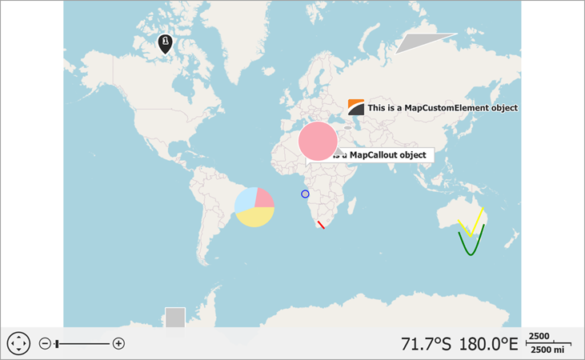

<!-- default badges list -->

<!-- default badges end -->

# Map for WinForms - Create Different Map Shapes

This example shows how to create map shapes and add them to a vector layer. 

Follow the steps below to add map shapes to the map:

1. Add a [VectorItemsLayer](https://docs.devexpress.com/WindowsForms/DevExpress.XtraMap.VectorItemsLayer) object to the [MapControl.Layers](https://docs.devexpress.com/WindowsForms/DevExpress.XtraMap.MapControl.Layers) collection.
2. Initialize the [VectorItemsLayer.Data](https://docs.devexpress.com/WindowsForms/DevExpress.XtraMap.VectorItemsLayer.Data) property with a [MapItemStorage](https://docs.devexpress.com/WindowsForms/DevExpress.XtraMap.MapItemStorage) object.
3. Add shape objects to the [MapItemStorage.Items](https://docs.devexpress.com/WindowsForms/DevExpress.XtraMap.MapItemStorage.Items) collection.

The following shapes are available:

* [MapBubble](https://docs.devexpress.com/WindowsForms/DevExpress.XtraMap.MapBubble)
* [MapCallout](https://docs.devexpress.com/WindowsForms/DevExpress.XtraMap.MapCallout)
* [MapCustomElement](https://docs.devexpress.com/WindowsForms/DevExpress.XtraMap.MapCustomElement)
* [MapDot](https://docs.devexpress.com/WindowsForms/DevExpress.XtraMap.MapDot)
* [MapEllipse](https://docs.devexpress.com/WindowsForms/DevExpress.XtraMap.MapEllipse)
* [MapLine](https://docs.devexpress.com/WindowsForms/DevExpress.XtraMap.MapLine)
* [MapPath](https://docs.devexpress.com/WindowsForms/DevExpress.XtraMap.MapPath)
* [MapPie](https://docs.devexpress.com/WindowsForms/DevExpress.XtraMap.MapPie)
* [MapPolygon](https://docs.devexpress.com/WindowsForms/DevExpress.XtraMap.MapPolygon)
* [MapPolyline](https://docs.devexpress.com/WindowsForms/DevExpress.XtraMap.MapPolyline)
* [MapPushpin](https://docs.devexpress.com/WindowsForms/DevExpress.XtraMap.MapPushpin)
* [MapRectangle](https://docs.devexpress.com/WindowsForms/DevExpress.XtraMap.MapRectangle)
* [MapSpline](https://docs.devexpress.com/WindowsForms/DevExpress.XtraMap.MapSpline)

## Files to Look At

* [Form1.cs](./CS/MapItemsExample/Form1.cs) (VB: [Form1.vb](./VB/MapItemsExample/Form1.vb))

## Documentation

* [Vector Items](https://docs.devexpress.com/WindowsForms/15091/controls-and-libraries/map-control/visual-elements/vector-items)
* [Map Editor](https://docs.devexpress.com/WindowsForms/120215/controls-and-libraries/map-control/end-user-features/map-editor)

## More Examples

* [How to move a Map Pushpin element at runtime](https://github.com/DevExpress-Examples/how-to-move-a-map-pushpin-element-at-runtime-t190789)
* [How to manually provide vector items from WKT](https://github.com/DevExpress-Examples/how-to-manually-provide-vector-items-from-wkt-t222638)
* [How to manually generate vector items to display on a map](https://github.com/DevExpress-Examples/how-to-manually-generate-vector-items-to-display-on-a-map-t114954)
* [How to manually generate map items for received GIS data](https://github.com/DevExpress-Examples/how-to-manually-generate-map-items-for-received-gis-data-t188443)
* [How to load data from a SQL geometry data source](https://github.com/DevExpress-Examples/how-to-load-data-from-a-sql-geometry-data-source-t175898)
* [How to display bubble chart items on a map](https://github.com/DevExpress-Examples/how-to-display-bubble-chart-items-on-a-map-t113410)
* [How to customize drawing of vector items on a map](https://github.com/DevExpress-Examples/how-to-customize-drawing-of-vector-items-on-a-map-t120297)
* [How to color manually added shapes using the choropleth colorizer](https://github.com/DevExpress-Examples/how-to-color-manually-added-shapes-using-the-choropleth-colorizer-e4744)
* [How to customize shape title options](https://github.com/DevExpress-Examples/how-to-customize-shape-title-options-t202086)
* [How to customize the appearance of a map shape title](https://github.com/DevExpress-Examples/how-to-customize-the-appearance-of-a-map-shape-title-e5184)
* [How to Use Clusterers to Aggregate Vector Items](https://github.com/DevExpress-Examples/winforms-map-aggregate-vector-items-using-a-clusterer)
